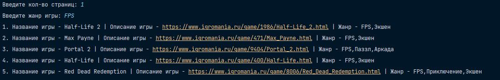

[](https://github.com/RusskiyPythonist/GameParserByGenre)
[](https://github.com/RusskiyPythonist/GameParserByGenre)

**GameParserByGenre** -- скрипт-парсер для Python.

Данный скрипт берёт и анализирует информацию с сайта https://igromania.ru/games Тем самым парсит заданное количество страниц и выводит в консоль игры по жанру.



**GameParserByGenre** -- программа с открытым исходным кодом и бесплатна для использования.

## Характеристики

- Работает на Windows
- Код написан на Python
- Программа работает асинхронно
- Открытый исходный ход
- Предел в кол-ве страниц: 23920

## Как запустить

### Windows

После установки [Python3](https://www.python.org/) (версии 3.7 или выше) необходимо выполнить следующую команду для установки необходимых библиотек:

```sh
pip install -r requirements.txt
```

Далее, Вы можете запустить файл **main.py** через Ваш IDE или выполнить следующую команду:

```sh
python main.py
```

## Как работает

После запуска файла, Вам предложит ввести кол-во страниц для парсинга. Кол-во выводимых игр напрямую зависит от кол-ва необходимых страниц.

### (ПРИМЕЧАНИЕ: Кол-во страниц может быть только **целым числом** и не привышать 23920)

После того, как Вы ввели количество страниц, Вам предложит ввести жанр игры. Ввести можно следующие жанры:

- Beat-em-Up
- FPS
- Hack And Slash
- MMO
- MOBA
- Point & Click
- Roguelike
- TD
- TPS
- Аркада
- Визуальная новелла
- Выживание
- Гонки
- Игра для взрослых
- Интерактивное кино
- История
- Квест
- ККИ
- Кооператив
- Менеджер
- Метроидвания
- Музыка
- Настольная игра
- Обучение
- Паззл
- Платформер
- Пошаговая стратегия
- Приключение
- Ролевая игра
- Симулятор
- Симулятор ходьбы
- Спорт
- Стелс
- Стратегия
- Стратегия в реальном времени
- Тактика
- Файтинг
- Хоррор

При **правильном** вводе жанра игры, консоль выведет сообщение, в формате:
```sh
Название игры - [Название] | Описание игры - [Ссылка на страницу игры на сайте] | Жанр - [Жанр(ы) игры]
```

Если Вы ввели несуществующий жанр (см. список выше) или жанр которого нету на странице, то программа ничего не выведет и завершит работу.
